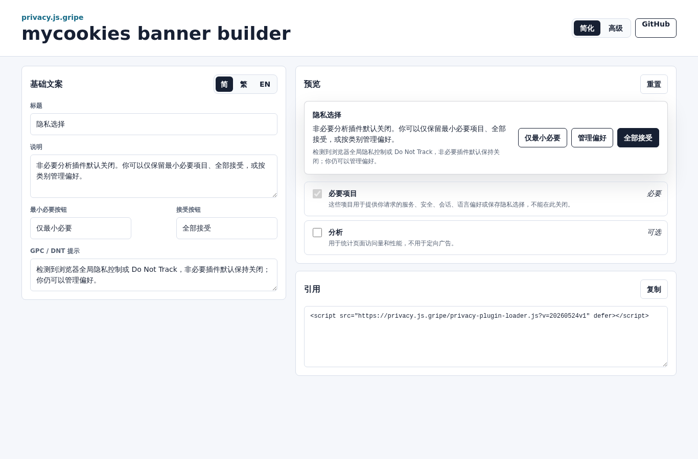
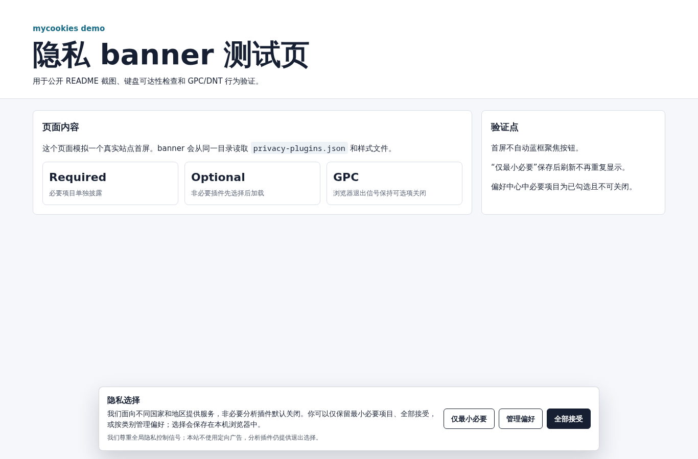
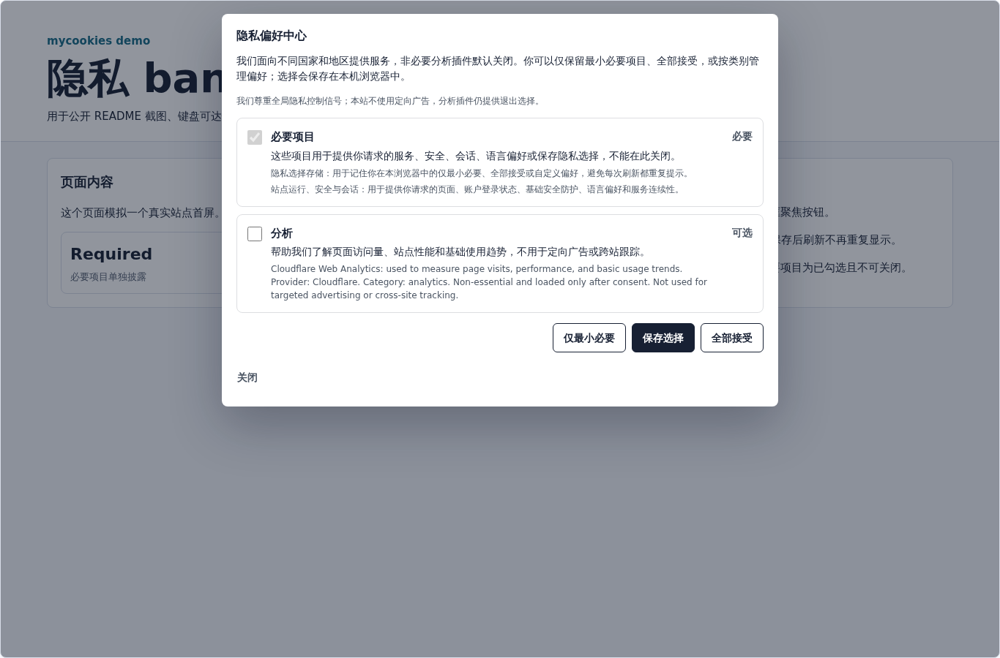
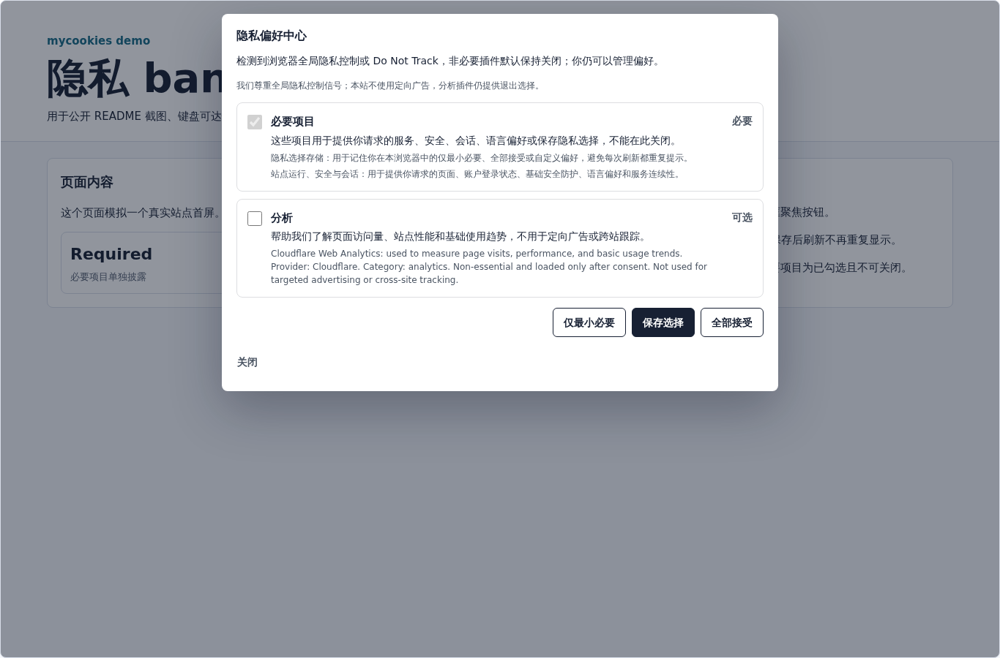

# mycookies

`mycookies` is a small, dependency-free privacy banner controller for static sites and web apps. It gates optional third-party scripts, stores the visitor's choice in `localStorage`, provides a preference center, and includes accessible dialog markup and keyboard behavior.

This is a compliance-oriented implementation helper, not legal advice. Review your final configuration with counsel for the regions where you operate.

The hosted builder lives at `https://privacy.js.gripe/`. It opens in a simplified view for everyday banner copy, preview, and embed code. Switch to Advanced when you need to edit required-service disclosures, optional plugins, imports, or raw JSON.

## What It Does

- Shows a first-run privacy choices banner.
- Lets visitors keep only required services, accept all, or manage preferences by category.
- Loads optional scripts only after the matching category is accepted.
- Displays required services separately from optional categories.
- Stores consent in `privacy_plugins_consent_v4`.
- Migrates all-off legacy `privacy_plugins_consent_v3` choices.
- Detects Global Privacy Control and Do Not Track as an opt-out signal, so optional plugins start off by default.
- Keeps analytics optional under GPC/DNT instead of turning it into an unchangeable required item.
- Avoids initial auto-focus on action buttons.
- Supports `aria-labelledby`, `aria-describedby`, `aria-modal`, focus handling, Escape close, and visible keyboard focus states.

## Files

The deployable files are in `public/`:

- `index.html`
- `builder.css`
- `builder.js`
- `demo.html`
- `privacy-plugin-loader.js`
- `privacy-plugin-banner.css`
- `privacy-plugins.json`
- `_headers`

## Quick Deploy

The simplest integration is to reference the hosted loader before `</body>`:

```html
<script src="https://privacy.js.gripe/privacy-plugin-loader.js?v=20260524v1" defer></script>
```

When loaded from `privacy.js.gripe`, the loader automatically fetches `https://privacy.js.gripe/privacy-plugins.json` and `https://privacy.js.gripe/privacy-plugin-banner.css`.

If you self-host the files or keep a site-specific config somewhere else, pass URLs explicitly:

```html
<script
  src="https://privacy.js.gripe/privacy-plugin-loader.js?v=20260524v1"
  data-config="/assets/privacy-plugins.json"
  data-stylesheet="/assets/privacy-plugin-banner.css"
  defer
></script>
```

Use a version query string when you deploy a new banner build so browsers and CDNs fetch the latest file.

## 中文快速使用

`mycookies` 可以直接使用线上版本，不依赖框架。先在 `https://privacy.js.gripe/` 可视化编辑 banner 内容、必要项目和可选插件，再把生成的 `privacy-plugins.json` 发布到 `privacy.js.gripe` 的静态文件中。业务站点只需要在页面底部引用：

```html
<script src="https://privacy.js.gripe/privacy-plugin-loader.js?v=20260524v1" defer></script>
```

默认情况下，loader 会自动从同一域名读取：

- `https://privacy.js.gripe/privacy-plugins.json`
- `https://privacy.js.gripe/privacy-plugin-banner.css`

如果你的配置文件或样式文件不在 `privacy.js.gripe`，用 `data-config` 和 `data-stylesheet` 指定路径：

```html
<script
  src="https://privacy.js.gripe/privacy-plugin-loader.js?v=20260524v1"
  data-config="https://example.com/privacy-plugins.json"
  data-stylesheet="https://example.com/privacy-plugin-banner.css"
  defer
></script>
```

每次更新 loader、样式或配置后，建议更新 `?v=` 后面的版本号，避免浏览器或 CDN 继续使用旧文件。

## Configure Plugins

Edit `privacy-plugins.json`.

Minimal example:

```json
{
  "version": 3,
  "consent": {
    "mode": "always-prompt",
    "storageVersion": 4
  },
  "ui": {
    "en": {
      "bannerTitle": "Privacy Choices",
      "bannerMessage": "Optional analytics plugins are off by default. You can keep only required services, accept all, or manage preferences.",
      "rejectAll": "Only necessary",
      "acceptAll": "Accept all",
      "customize": "Customize",
      "save": "Save choices",
      "close": "Close",
      "preferences": "Privacy Preference Center",
      "settings": "Privacy settings",
      "required": "Required",
      "optional": "Optional",
      "requiredServicesTitle": "Required services",
      "requiredServicesDescription": "These services provide the requested site, security, session, language preference, or privacy-choice storage and cannot be turned off here.",
      "gpc": "A browser Global Privacy Control or Do Not Track signal was detected, so optional plugins start off by default; you can still manage preferences.",
      "categories": {
        "analytics": {
          "title": "Analytics",
          "description": "Helps us understand page visits and site performance."
        }
      }
    }
  },
  "requiredServices": [
    {
      "id": "privacy-choice-storage",
      "name": "Privacy choice storage",
      "disclosure": {
        "en": "Privacy choice storage: remembers your only-necessary, accept-all, or custom preference in this browser so the banner does not repeat on every refresh."
      }
    }
  ],
  "plugins": [
    {
      "id": "cloudflare-web-analytics",
      "name": "Cloudflare Web Analytics",
      "enabled": true,
      "type": "script",
      "src": "https://static.cloudflareinsights.com/beacon.min.js",
      "attributes": {
        "defer": true,
        "data-cf-beacon": "{\"token\":\"YOUR_TOKEN\"}"
      },
      "policy": {
        "category": "analytics",
        "consentMode": "always-prompt"
      }
    }
  ]
}
```

## 中文配置说明

主要自定义都在 `privacy-plugins.json`：

- `ui`: 设置弹窗和偏好中心文案。可以按语言写 `zh-CN`、`zh-TW`、`en`，也可以加入自己的语言键。常用字段包括 `bannerTitle`、`bannerMessage`、`rejectAll`、`acceptAll`、`customize`、`save`、`requiredServicesTitle`、`requiredServicesDescription`、`gpc` 和 `categories`。
- `requiredServices`: 写入真正必要的项目说明。这些项目会在偏好中心显示为已勾选且不可关闭，用于透明披露，不代表可以把任何第三方脚本都改成必要。
- `plugins`: 写入可选插件。每个插件可设置 `id`、`name`、`type`、`src`、`attributes` 和 `policy.category`。例如分析类插件放到 `analytics`，并用 `always-prompt` 在加载前先取得选择。
- `disclosure`: 建议对每个必要项目或可选插件写清楚“做什么、为什么需要、是否第三方、是否跨境或外部传送”。字段可以是字符串，也可以是多语言对象。

示例：

```json
{
  "ui": {
    "zh-CN": {
      "bannerTitle": "隐私选择",
      "bannerMessage": "非必要分析插件默认关闭。你可以仅保留最小必要项目、全部接受，或按类别管理偏好。",
      "rejectAll": "仅最小必要",
      "acceptAll": "全部接受",
      "customize": "管理偏好",
      "requiredServicesTitle": "必要项目",
      "requiredServicesDescription": "这些项目用于提供你请求的服务、安全、会话、语言偏好或保存隐私选择，不能在此关闭。",
      "categories": {
        "analytics": {
          "title": "分析",
          "description": "帮助了解访问量和性能，不用于广告定向或跨站跟踪。"
        }
      }
    }
  },
  "requiredServices": [
    {
      "id": "privacy-choice-storage",
      "name": "隐私选择存储",
      "disclosure": {
        "zh-CN": "用于记住本浏览器中的仅最小必要、全部接受或自定义偏好，避免刷新后重复显示横幅。"
      }
    }
  ],
  "plugins": [
    {
      "id": "analytics-example",
      "name": "Analytics Example",
      "enabled": true,
      "type": "script",
      "src": "https://example.com/analytics.js",
      "attributes": { "defer": true },
      "policy": { "category": "analytics", "consentMode": "always-prompt" },
      "disclosure": {
        "zh-CN": "用于统计页面访问量和性能，不用于定向广告。"
      }
    }
  ]
}
```

## Required Services

Some jurisdictions and regulators expect clear disclosure of storage/access that is necessary for the requested service, even when consent is not requested for those items. `mycookies` supports this with `requiredServices`.

Required services are shown in the preference center as checked and disabled. They are separate from optional categories such as analytics. Use them only for genuinely necessary purposes such as:

- remembering the privacy choice itself;
- account session continuity;
- security and abuse prevention;
- language, accessibility, or UI preference needed to provide the requested page;
- service continuity for the current request.

Do not place analytics, advertising, cross-site tracking, A/B testing, heatmaps, remarketing, or convenience-only features in `requiredServices`.

### 必要项目合规边界

通常可以放入 `requiredServices` 的，是为了提供用户正在请求的页面或服务而不可缺少的项目，例如：

- 隐私选择本身的存储；
- 登录会话、CSRF 防护、基础安全、防滥用和故障排查；
- 站点路由、负载均衡、CDN 安全、服务可用性；
- 语言、无障碍或界面偏好，且这些偏好是提供当前页面所必需的；
- 购物车、表单草稿、账户安全通知等用户明确请求流程中的必要状态。

不要放入必要项目的包括：访问统计、A/B 测试、广告、再营销、跨站跟踪、社交分享追踪、热力图、个性化推荐、便利性但非必要的小组件。面对欧盟/英国、加拿大、巴西、加州、澳大利亚、香港、台湾、日本、韩国、新加坡、中国大陆等不同地区访客时，建议采用更保守做法：必要项目清楚披露，可选项目先选择后加载，并允许撤回。

## Global Privacy Control And Do Not Track

When `navigator.globalPrivacyControl`, `navigator.doNotTrack`, or `window.doNotTrack` signals opt-out:

- Optional plugins start off by default.
- The banner explains the browser signal.
- Categories remain optional, not required.
- Checkboxes remain selectable.
- The visitor can still keep only required services, accept all, or save custom choices.

This avoids turning analytics into an unchangeable "Required" item while still respecting the browser-level signal as the default state.

## Styling

The banner stylesheet is intentionally plain CSS. You can override placement with CSS variables:

```css
:root {
  --privacy-plugin-banner-bottom: 24px;
  --privacy-plugin-settings-bottom: 24px;
}
```

For pages where a fixed bottom banner would cover an auth form or popup, override the banner on that page:

```css
body[data-page="login"] .privacy-plugin-banner {
  position: static;
  width: min(980px, calc(100% - 32px));
  margin: 24px auto;
}
```

## Programmatic API

After the loader boots, it exposes:

```js
window.JSGripePrivacy.openPreferences();
window.JSGripePrivacy.reset();
```

Use `openPreferences()` from a footer "Privacy settings" link if you prefer a custom trigger.

## Screenshots

### Visual Builder



### Demo Banner



### Demo Preference Center



### GPC/DNT Preference Center

This screenshot is captured with `navigator.globalPrivacyControl === true`. Required services are disclosed separately, and analytics remains optional and selectable.



## Check

```bash
npm run check
```

## Browser Support

The controller uses modern browser APIs available in current evergreen browsers:

- `fetch`
- `localStorage`
- `dataset`
- optional chaining
- `Intl.DateTimeFormat().resolvedOptions().timeZone`

No package manager, build step, or framework is required for normal deployment.

## License

MIT
